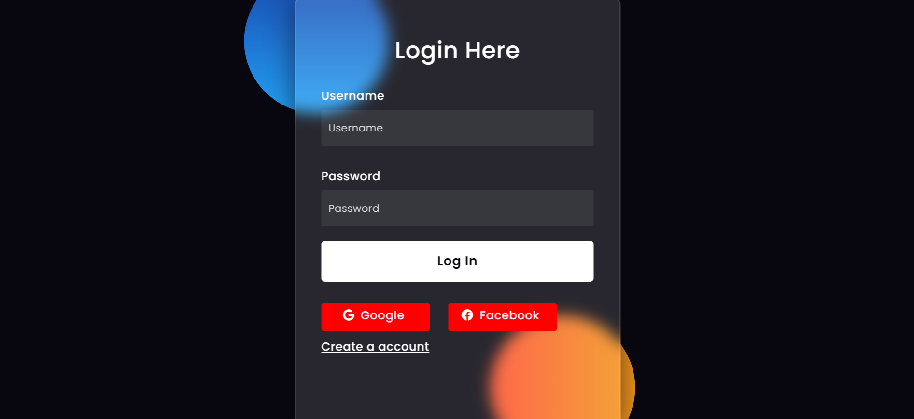

# Tên ứng dụng

- Web bán xe ô tô (Gợi ý: ứng dụng giải quyết vấn đề gì, có các đối tượng người dùng như thế nào, có các chức năng gì...)

- Bạn có thể trải nghiệm ứng dụng ở đây [LINK](http://127.0.0.1:8000/)
- Một số sceenshot của ứng dụng:

## CÀI ĐẶT

Hướng dẫn cài đặt và chạy sau khi pull project từ github về (Lưu ý: hướng dẫn phải chạy được). Bao gồm:
- Đầu tiên, cài đặt Python trên máy tính. Điều này có thể được thực hiện bằng cách tải xuống từ trang web chính thức của Python (https://www.python.org/downloads/) và cài đặt theo hướng dẫn. Lưu ý cài đặt Python mới nhất.
- Mở terminal và chạy các lệnh sau để cài đặt Django và các gói thư viện cần thiết: pip install django djangorestframework djangorestframework-simplejwt django-filter
- Pull project từ GitHub về máy tính của bạn bằng lệnh sau trong terminal: git clone <url_repository> Trong đó <url_repository> là đường dẫn URL của repository GitHub mà bạn muốn pull về.
- Sau khi pull project về, bạn cần thực hiện các bước sau để cấu hình và chạy dự án Django:
    - Di chuyển vào thư mục project: cd <tên_thư_mục_project>
    - Cài đặt các migrations:
        - python manage.py makemigrations
        - python manage.py migrate
    - Tạo superuser (nếu cần thiết): python manage.py createsuperuser
    - Chạy server Django: python manage.py runserver
-> Mở trình duyệt và truy cập vào địa chỉ http://localhost:8000 (hoặc địa chỉ mà server Django thông báo trong terminal) để kiểm tra xem dự án đã hoạt động đúng không. 
- Script tạo database (Để script trong thư mục installation)
- Script tạo dữ liệu (Để script trong thư mục installation)

## THÔNG TIN THÀNH VIÊN

- Nguyễn Tiến Dũng - 21003901
- Trương Xuân Hùng - 21090141
- Nguyễn Trọng Nghĩa - 21031271
- Lê Thanh Phúc - 21025861

## TRÁCH NHIỆM

- Thành viên 1: Nguyễn Tiến Dũng
    - back-end: trang chủ, trang quản lý hãng, liên hệ, quản lý xe, thông tin khuyến mãi.
    - Viết nội dung report, làm slide.
- Thành viên 2: Trương Xuân Hùng
    - front-end: trang quản lý hãng, liên hệ, quản lý xe, thông tin khuyến mãi.
    - Viết nội dung report.
- Thành viên 3: Nguyễn Trọng Nghĩa
    - front-end : Quản lý danh sách, trang thanh toán.
    - Viết report, làm slide.
- Thành viên 4: Lê Thanh Phúc
    - Lên ý tưởng phát triển đề tài,
    - viết nội dung report.
    - front-end: trang chủ.
