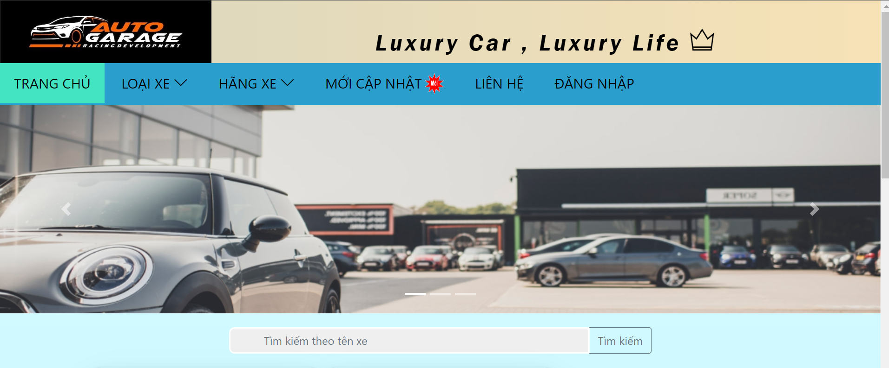

## 4. HIỆN THỰC

### 4.1. Công nghệ sử dụng

Giới thiệu các công nghệ sử dụng ở đây (từ front-end, back-end, extensions...)
- Các công nghệ được sử dụng ở đây: 
    - Ngôn ngữ lập trình: Python, Django, HTML, CSS, javaScript, SQlite, Bootstrap
    - Framework:  Django REST Framework, django-rest-framework-jwt
    - Something: Django-filter, Github

### 4.2. Giao diện ứng dụng

Chụp hình một số screenshots của ứng dụng

### 4.3. Kết quả

- Các kết quả làm được:
    - Xem danh sách sản phẩm, chi tiết của từng sản phẩm
    - Các chức năng thêm, sửa, xóa của user, vehicle
    - Đăng nhập, đăng ký

- Các kết quả chưa làm được:
    

- Hướng phát triển