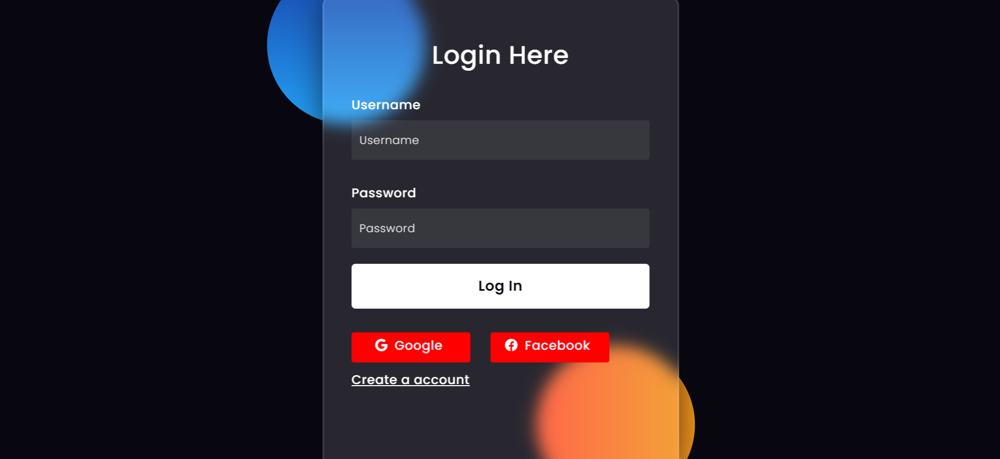

## 4. HIỆN THỰC

### 4.1. Công nghệ sử dụng

Giới thiệu các công nghệ sử dụng ở đây (từ front-end, back-end, extensions...)
- Các công nghệ được sử dụng ở đây: 
    - Ngôn ngữ lập trình: Python, Django, HTML, CSS, javaScript, SQlite, Bootstrap
    - Framework:  Django REST Framework, django-rest-framework-jwt
    - Something: Django-filter, Github

### 4.2. Giao diện ứng dụng

Chụp hình một số screenshots của ứng dụng

### 4.3. Kết quả

- Các kết quả làm được:
    - Xem danh sách sản phẩm, chi tiết của từng sản phẩm
    - Các chức năng thêm, sửa, xóa của user, vehicle
    - Đăng nhập, đăng ký
    - Tìm kiếm, phân loại các vehicle theo hãng xe, theo tên
    - Quản lý thông tin user, vehicle, 

- Các kết quả chưa làm được:
    - Thêm sản phẩm vào giỏ
    - Thanh toán
    - So sánh 2 xe 
    - Chưa phân quyền nhân viên và quản lý

- Hướng phát triển:
    - Hoàn thiện những phần ở mục chưa làm được
    - Thêm đăng nhập google hoặc facebook để thuận tiện cho người dùng
    - Phát triển thêm 1 số tính năng khác như dự đoán nhu cầu, gợi ý cho người dùng,...