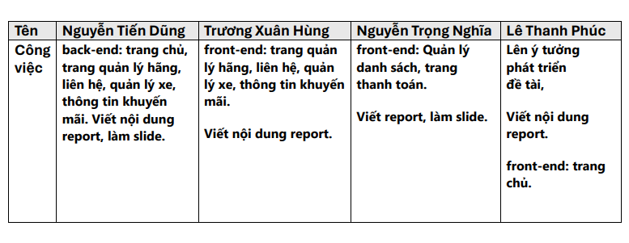

## 5. GHI CHÚ CÁC CÔNG VIỆC

### 5.1 Phân công

Bảng phân chia công việc

### 5.2 Nhật ký

- Tuần 15/04 - 21/04: 
    - Thực hiện
        - Họp nhóm trực tiếp tại trường chọn đề tài.
        - Các thành viên đề xuất ý tưởng chọn đề tài.
    - Vấn đề
        - Thống nhất đề tài nhưng chưa có tưởng cụ thể.
- Tuần 21/04 - 28/04:
  - Các thành viên đề xuất ý tưởng cho đề tài.
  - Phân công công việc cho các thành viên.
- Tuần 28/04 - 05/05
  - Các thành viên họp nhóm zoom trình bày những khó khăn gặp phải.
  - Các thành viên hỗ trợ lẫn nhau.
- Tuần 05/05 - 12/05
  - Các thành viên cập nhật tiến độ công việc.
  - Xử lý những vấn đề còn vướng mắc.
- Tuần 12/05 - 19/05
  - Các thành viên bàn giao lại công việc.
  - Kiểm tra lại công việc của các thành viên.
- Tuần 19/05 - 26/05
  - Tổng hợp lần cuối đề tài.
  - Trình bày những vấn đề chưa hoàn thiện của đề tài.
  - Xem và sửa lỗi lần cuối
- Tuần 26/05 - 02/06
  - Báo cáo đề tài.
